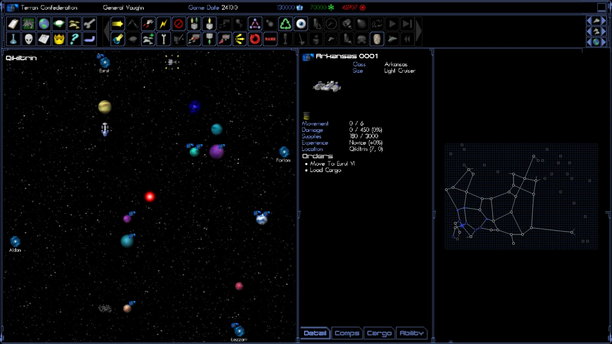
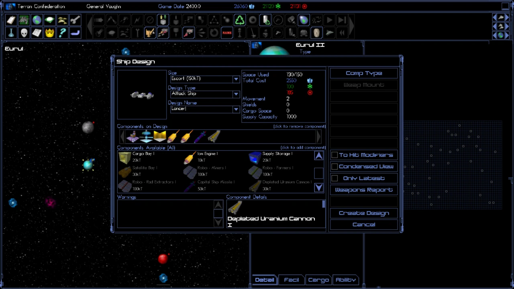
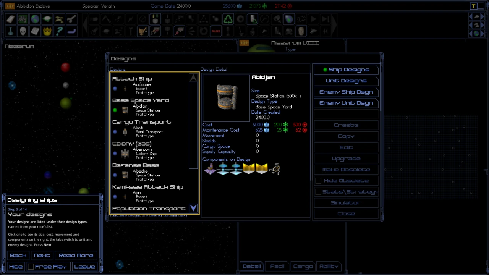

# OpenSE4

[](https://github.com/lowlevelmetal/OpenSE4/actions/workflows/ci.yml)

**An open-source engine reimplementation for Space Empires IV Deluxe.**

OpenSE4 is a new engine, written from scratch in C++23, with Vulkan rendering and an
OpenGL fallback. It is being built to play Space Empires IV Deluxe faithfully, the way
OpenXcom plays UFO: Enemy Unknown or OpenTTD plays Transport Tycoon Deluxe.

- **You need your own copy of Space Empires IV Deluxe.** It is available on Steam.
  OpenSE4 reads the game's data files, art and sound from your installation at
  runtime. None of the original game ships with this project, and OpenSE4 will never
  replace it with art or data of its own: buy the original to play.
- **Written from specs, nothing copied.** The rules are reimplemented from the manual,
  the game's documented data formats, observation of the running game and, since
  2026-09-29, analysis of the original executable. Findings are written up as
  plain-language specs and the code is written from those; no code, data, art or
  text from the original is copied or shipped. See
  [docs/CLEANROOM.md](docs/CLEANROOM.md).
- **Playable.** Every part of the classic rules is implemented:
  - economy and population;
  - ships and movement;
  - combat: strategic and tactical, with replays and the combat simulator;
  - research, intelligence, diplomacy and events;
  - computer players.

  The game has the classic windows, sound and music, runs hotseat, network (with
  UPnP) and PBEM multiplayer, and includes a dedicated server. Every rule has been
  checked against the original. [docs/PARITY_PLAN.md](docs/PARITY_PLAN.md) tracks what
  remains:
  - small details the original leaves open, where the engine makes its own choice;
  - a few differences in how the computer players expand, still being measured.

`opense4` finds your install on its own, or takes its location with `--classic-dir`.
Without an install it explains where it looked and exits: there is no game to play
without your copy. [docs/ENGINE.md](docs/ENGINE.md) is the map of the engine's code.

## Screenshots

| | | |
|---|---|---|
|  |  |  |
| A star system, a hundred turns in | Designing a warship | A guided tutorial |

The screenshots show OpenSE4 running on an installed copy of Space Empires IV Deluxe:
the art is the original game's, read from that install.

## What OpenSE4 adds

The rules and the classic windows stay as they were. Around them, OpenSE4 brings the
game to today's machines and adds what a newcomer or a multiplayer group needs.

**Modern screens and systems**
- **Widescreen:** the 1024x768 layout stretches to use the whole width, up to 21:9, with
  a larger system view and galaxy map. Classic 4:3 with bars is a setting away.
- **Any resolution:** the classic layouts are scaled to any window or screen, windowed,
  borderless or fullscreen. There are options for sharp pixels, whole-number scaling and a
  larger text size.
- **Native on Linux and Windows**, built for macOS too, with Vulkan rendering and an OpenGL
  fallback. A Windows installer and a Linux desktop entry come with the release.

**Learning the game**
- **Seven guided tutorials:**
  - every step points at what to use and waits until you have done it;
  - close a window the lesson still needs and it shows you how to reopen it;
  - steps that take several turns count your progress;
  - you can leave a lesson and resume it later.
- **Five training games** with goals to meet: a land rush, a research sprint, holding a
  fortress, a first treaty and a conquest.
- **A built-in manual** of 24 chapters, linked from the lessons. Shift+F1 opens the page
  for the window in front.

**Playing together**
- **Network play** over TCP:
  - simultaneous turns, or one player after another (an OpenSE4 extension);
  - the router is set up automatically over UPnP, and games on the local network are found
    on their own;
  - connections are encrypted, and the game remembers each host's key, so an impostor
    can't pose as your host;
  - passwords never travel.
- **Dropped connections and desyncs:** a dropped player reconnects without losing the
  turn. A copy of the game that drifts from the host's is detected, reported and repaired.
- **Play by e-mail**, through mail or a shared folder: each player's turn file holds only
  that player's view, encrypted for them and signed by the host.
- **A dedicated server** (`opense4-server`) hosts network games and processes e-mail turns
  without a player at the keyboard.
- **The same game on every machine:** the engine is deterministic, so a Linux host and a
  Windows player see exactly the same results. Hotseat play on one machine works too.

**Comfort**
- **Hotkeys you can change:** the classic keys work, and every one can be rebound
  (Settings → Controls).
- **Small additions:**
  - the Galaxy Map can show jump distances;
  - Help can search;
  - combat replays can list each turn's events.
- **Mods:** packages of pictures, sounds and data patches layer over your installed game
  without changing it; patches change single records, so mods combine. Choose them in the
  Mods window. Pictures may be PNG and larger than the original's, sounds and music OGG
  Vorbis, and a design may show a picture of its own. Classic mods load as packages too.
  `opense4-sdk` makes, checks and packs mods, and `opense4-datacheck` checks a modded data
  set and names the file, line and record of anything it doesn't understand.
- **Your games from the original:** Load Game opens the original's saved games and
  converts them, and Save Game can write a game back for the original, so a game moves
  between the two (docs/SETUP.md, "Games of the original"). `opense4-convert` does the same
  on the command line.

**Planned:** a Steam release with multiplayer through Steam, Steam Workshop support, and
the rest of the modding SDK, with Python scripts (docs/MODDING_SDK.md). See "Future goals" in
[docs/PARITY_PLAN.md](docs/PARITY_PLAN.md#future-goals).

## System requirements

- **Your own copy of Space Empires IV Deluxe** (see "Setting up the game data").
- **Windows:** 64-bit Windows 7 with Service Pack 1, 8, 8.1, 10 or 11, with nothing else
  to install. Windows 7 drivers seldom offer Vulkan 1.3, so there the game draws with
  OpenGL 3.3. That needs the current driver from the graphics card's maker (NVIDIA, AMD
  or Intel): Windows' own basic display driver has no OpenGL 3.3. Graphics chips older
  than about 2012 may have none either (Intel HD Graphics 2000 and 3000, for example).
  Windows 7, 8 and 8.1 support is checked by analysing the programs' imports and by
  running them under Wine set to Windows 7; it has not been tested on real Windows 7.
- **Linux:** glibc 2.34 or later (Ubuntu 22.04, Debian 12, Fedora 35, SteamOS 3 and
  newer; on ARM also Raspberry Pi OS 12 and Fedora Asahi Remix), and Vulkan 1.3 or
  OpenGL 3.3. Each release has a package for each architecture:
  - `OpenSE4-<version>-linux-x86_64.tar.gz`: 64-bit PCs;
  - `OpenSE4-<version>-linux-aarch64.tar.gz`: 64-bit ARM;
  - `OpenSE4-<version>-linux-armhf.tar.gz`: 32-bit ARM, ARMv7 or newer with NEON (a
    Raspberry Pi 2 or later on the 32-bit Raspberry Pi OS, for example).

  Nothing else needs installing: SDL is built in and loads X11 or Wayland, the GPU
  driver and the sound server at run time. Every architecture computes the same game,
  so they play together over the network and by e-mail.
- **macOS:** builds from source (see [docs/BUILDING.md](docs/BUILDING.md)); there is no
  package.

### Graphics on ARM

On ARM, whether the GPU offers Vulkan 1.3 or OpenGL 3.3 depends on the chip and the
Mesa version:

| Device | Vulkan 1.3 | OpenGL 3.3 |
|---|---|---|
| Raspberry Pi 5 and Pi 4 (with Pi 400, CM4, CM5) | Yes, V3DV from Mesa 24.3: Raspberry Pi OS 13, 64-bit and 32-bit. Raspberry Pi OS 12 (Mesa 24.2) has Vulkan 1.2 only | No: V3D offers OpenGL 3.1 |
| Rockchip RK3588 and RK3588S (Mali-G610) | Yes, PanVK from Mesa 25.2 (Ubuntu 25.10 or newer; Debian 13's Mesa 25.0 is too old) | No: Panfrost offers OpenGL 3.1 |
| Rockchip RK356x, RK3576 and others with Bifrost Mali (G52, G31) | Experimental in PanVK and off by default | No (OpenGL 3.1) |
| Apple M1 and M2 Macs under Asahi Linux | Yes (Vulkan 1.4) | Yes (OpenGL 4.6). M3 graphics are still in development |
| Snapdragon X Elite laptops (Adreno X1-85) | Yes, Turnip | Yes, Freedreno (Mesa 24.2 or newer), where the laptop's Linux support enables the GPU |
| Raspberry Pi 3 and older, Pi Zero and Zero 2; other boards with only OpenGL ES 2 | No | No (OpenGL 2.1) |

`--renderer=auto` (the default) picks whichever works. Machines that have neither, such
as the Raspberry Pi 3 and older 32-bit boards, cannot run the game, but they can host
it: the dedicated server `opense4-server` needs no GPU and no display (the armhf package
on ARMv7 boards such as the Pi 2, aarch64 on 64-bit systems; the ARMv6 Pi 1, Pi Zero and
Zero W are not supported). On ARM, copy the game's files from a PC, since Steam does not
run there (see [docs/SETUP.md](docs/SETUP.md)).

## Building

Full instructions for Linux, Windows and macOS are in
[docs/BUILDING.md](docs/BUILDING.md). In short, you need:

- a C++23 compiler (GCC 14+, Clang 18+, MSVC 17.10+ or Apple Clang 21), CMake 3.25+ and Ninja;
- SDL3, which CMake fetches if the system has none;
- `glslc`, from the Vulkan SDK or `shaderc`.

```sh
cmake --preset debug              # or: release, asan
cmake --build --preset debug
ctest --preset debug
./build/debug/opense4
```

On Arch Linux, install them with `pacman -S cmake ninja sdl3 shaderc vulkan-headers`.

## Setting up the game data

OpenSE4 reads your installed copy of Space Empires IV Deluxe in place.
[docs/SETUP.md](docs/SETUP.md) explains:

- how to get the files, including on Linux and macOS;
- how OpenSE4 finds them;
- how to check a data set or a mod with `opense4-datacheck`.

## Multiplayer

Games are hosted from the client or with the dedicated `opense4-server`.

- **TCP:** direct play over the network, with simultaneous turns or one player after
  another. Connections are encrypted, the game remembers each host's key, and a
  dropped player reconnects without losing the turn. The default port is 6720, and the
  router is forwarded automatically over UPnP when the router allows it.
- **Hotseat:** several players on one machine.
- **PBEM:** turn files passed by mail or a shared folder. Each player's turn file holds
  only their own view, encrypted for them and signed by the host.

See [docs/MULTIPLAYER.md](docs/MULTIPLAYER.md).

## Running

```
opense4 [--renderer=auto|vulkan|opengl] [--classic-dir=DIR] [--quick-start[=RACE]] [--seed=N]
```

`--help` lists every option. With `--renderer=auto` (the default) the game tries
Vulkan 1.3 and falls back to OpenGL 3.3 if Vulkan is missing or unsuitable.

The game has the original's two screen layouts, 800x600 and 1024x768, drawn with your
install's art, fonts and mouse pointers and scaled to the window. Like the original,
OpenSE4 picks 800x600 when the desktop is at most 800 pixels wide and 1024x768
otherwise. `--layout=800x600` or `--layout=1024x768` forces one for a run, and
Settings → Graphics → Screen layout keeps the choice (forcing a layout is OpenSE4's
addition).

```sh
./build/debug/opense4                                # auto-detects a Steam install
./build/debug/opense4 --classic-dir=/path/to/se4     # or point at it
./build/debug/opense4 --quick-start=Terran           # skip the intro
./build/debug/opense4-datacheck                      # validate an installed or modded data set
./build/debug/opense4 --mod=path/to/a/mod            # play with a mod (docs/sdk/packages-and-data.md)
./build/debug/opense4 --load=/path/to/se4/SaveGame/GAME.gam   # play on a saved game of the original
./build/debug/opense4-convert --info GAME.gam        # describe a saved game of the original
./build/debug/opense4-server --players=2 --ai=3      # host a network game without playing
```

On Windows, the release's `-setup.exe` installs OpenSE4 for all users. It goes into
Program Files with a Start menu entry and, if you choose, a desktop shortcut, and you
remove it from Apps & features. The zip holds the same programs to run from any folder.
Saved games and settings live in `%APPDATA%\OpenSE4` either way.

On Linux, the game can appear in the desktop's application list (GNOME, KDE Plasma
and other freedesktop.org desktops):

- **Release package:** run `./install-desktop-entry.sh` in the unpacked folder. It adds
  the entry and icon for your user and starts the game from that folder. Run it again
  after moving the folder; `--uninstall` removes the entry.
- **Source build:** `cmake --install build/release --prefix ~/.local` (or
  `/usr/local`, with `sudo`) installs the programs, the desktop entry, the icons and
  the AppStream metadata.

The intro has the original's buttons: Quick Start, New Game (the full game and empire
setup), Resume Game (the last game you saved), Load Game, Tutorial, Scenario, Credits and
Quit Game. Tutorial and Scenario open OpenSE4's own guided lessons and training games
([docs/LEARNING.md](docs/LEARNING.md)); Multiplayer, Settings and the Manual sit at the top
right. During a game the Game Menu's Learn button opens them and Shift+F1 shows the
manual page for the window in front. In the game, the classic hotkeys work: F1–F12 open
the windows and End Turn, and letter and Ctrl keys give orders while their button is lit.
Pointing at a button names it and its key at the top of the system view; Help → Hotkeys
lists every key as bound, and Settings → Controls changes them. Autosaves are named
AutoSav0 to AutoSav9, and each player's statistics, history and log files go to
`History/` in the user data folder and travel with saved games. See
[docs/SETUP.md](docs/SETUP.md) and [docs/MULTIPLAYER.md](docs/MULTIPLAYER.md).

Headless screenshots, used for testing, work with SDL's offscreen driver:

```sh
SDL_VIDEO_DRIVER=offscreen ./build/debug/opense4 --quick-start=Terran --turns=30 --open=colonies --screenshot=shot.png
SDL_VIDEO_DRIVER=offscreen ./build/debug/opense4 --quick-start=Terran --turn-style=simultaneous --turns=20 --screenshot=sim.png
SDL_VIDEO_DRIVER=offscreen ./build/debug/opense4 --quick-start=Terran --turns=10 --open=none --screenshot=main.png  # no Log on top
SDL_VIDEO_DRIVER=offscreen ./build/debug/opense4 --quick-start=Terran --open=help:hotkeys --screenshot=keys.png
SDL_VIDEO_DRIVER=offscreen ./build/debug/opense4 --quick-start=Terran --layout=800x600 --size=800x600 --screenshot=small.png
```

## Modding

A mod is a folder or a `.zip` with a `mod.toml`. It can bring pictures, sounds, music and
fonts, and change the data: **data patches** add, change and remove single records of
any data file or computer players' table, by the data files' own field names, so several
mods combine. Mods may declare new ability names. Everything is layered over your
installed game in memory; nothing is written into it. Classic mods (replacement data
files and pictures) load as packages too.

```sh
opense4 --mod=path/to/mymod                    # play with a mod (or choose it in the Mods window)
opense4-sdk new data mymod --id=me.mymod       # start one from a template
opense4-sdk check mymod                        # apply it to your game and report every problem
opense4-sdk pack mymod                         # a .zip to share
```

Every error names the mod, file, line and record; typos are errors. Network and e-mail
games check that every player has the same game-changing mods. See
[docs/sdk/packages-and-data.md](docs/sdk/packages-and-data.md) and
[docs/SETUP.md](docs/SETUP.md#mods). Python scripts (computer players, rules hooks) come
with later steps of the SDK ([docs/MODDING_SDK.md](docs/MODDING_SDK.md)).

## Layout

```
src/core      math, deterministic RNG, typed ids, logging
src/datafile  reader for the classic "Key := Value" data format
src/ruleset   typed model of a complete classic data set
src/mods      mod packages, mod sets, the layered game files, data patches
src/game      classic-rules engine (implemented from docs/spec/)
src/net       multiplayer: sessions, protocol, UPnP port mapping
src/server    opense4-server: dedicated host and PBEM turn processor
src/assets    runtime access to the installed classic art
src/gfx       RHI with Vulkan and OpenGL backends, 2D batch renderer, ImGui bridge
src/client    the app shell and the classic client (windows, front end, multiplayer)
tools/        opense4-datacheck, opense4-convert (saved games), opense4-observe (drive the original), cleanroom_check.py
docs/spec/    rules specs, written in our own words
shaders/      GLSL shared by both backends
assets/       fonts (Noto Sans, SIL OFL)
packaging/    Linux desktop entry, application icon and AppStream metadata
tests/        doctest unit tests (our own fixtures only)
```

## License

OpenSE4 is free software: you can redistribute it and/or modify it under the terms
of the GNU General Public License as published by the Free Software Foundation,
either version 3 of the License, or (at your option) any later version. See
[LICENSE](LICENSE).

The Noto Sans fonts are under the SIL Open Font License (see
`assets/fonts/OFL.txt`). Bundled third-party libraries keep their own licences,
which the release packages list in `THIRD_PARTY_NOTICES.txt`. The GPL covers only
OpenSE4's own code and content; the original game's files stay the property of
their owners and are never part of OpenSE4.

## Trademarks

Space Empires is a trademark of its respective owner. OpenSE4 is an independent
project. It is not affiliated with, endorsed by or sponsored by Strategy First or
Malfador Machinations. The name is used only to say which game this engine is for.
